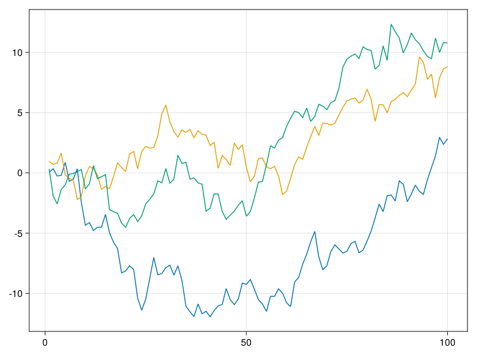

MakieDirectLabels
=================

This is a set of development codes (not a julia package yet...)
designed to play around with methods to make directly labeling plots easy.

Just look at the example of using [Voronoi cells to label plots](label-explainer.md)



```julia
using Random
Random.seed!(1)
using CairoMakie
include("voronoi-labels.jl")

f = lines(cumsum(randn(100)), label="Are Great",
  color=Cycled(1), marker=:rect)
lines!(f.axis, cumsum(randn(100)), label="Direct",
  color=Cycled(2))
lines!(f.axis, cumsum(randn(100)), label="Labels",
  color=Cycled(3))

# make it look nicer
f.axis.topspinevisible = false
f.axis.leftspinevisible = false
f.axis.rightspinevisible = false
f.axis.xgridvisible = false

labels = voronoi_labels!(f; offset=1.0)
labels[1].offset[] = 1.5 # manual tweak of one label 

f
```

Overview
--------

**Idea** deprecate legends!    
**Methods** modern heuristics, graph algorithms, maybe deep learning if needed.

**Inspirations**
- [Tufte, Tufte, Tufte](https://twitter.com/EdwardTufte/status/1274213603151880192/photo/1)
- https://observablehq.com/@harrystevens/directly-labelling-lines
- https://stackoverflow.com/questions/16992038/inline-labels-in-matplotlib

Needs help
----------
- It'd be awesome to add this idea too ... https://github.com/cphyc/matplotlib-label-lines

- The current code works in data coordinates. This would all be much better, 
and better scaled in screen coordinates. This would let us drop points that
are too close to reduce computation, it would let us handle log/scales/etc.
I regard this as almost a condition for making this a package. Otherwise, there
are too many issues that are going to come up. 

- Bounding boxes for text... it would be good to have these to jitter text
to optimize placement nearby selected points. 


Vision
-------
R has a similar package: <https://tdhock.github.io/directlabels/docs/index.html>

* `tail_labels!()` # automatically labels the "tail" of the plot like on our world in data.
    - <https://ourworldindata.org/explorers/coronavirus-data-explorer?zoomToSelection=true&time=2020-03-01..latest&facet=none&pickerSort=asc&pickerMetric=location&Metric=Confirmed+cases&Interval=7-day+rolling+average&Relative+to+Population=true&Color+by+test+positivity=false&country=USA~GBR~CAN~DEU~ITA~IND>
    - <https://github.com/nschloe/matplotx> where they are called `line_labels`
    - I've seen this done in R, but can't find the package now. 


* `direct_labels!()` # find a good place to label each line (what the current voronoi labels does)

* `inline_labels!()` # like the python example... https://github.com/cphyc/matplotlib-label-lines

The idea is to make adding even easier than a legend! 