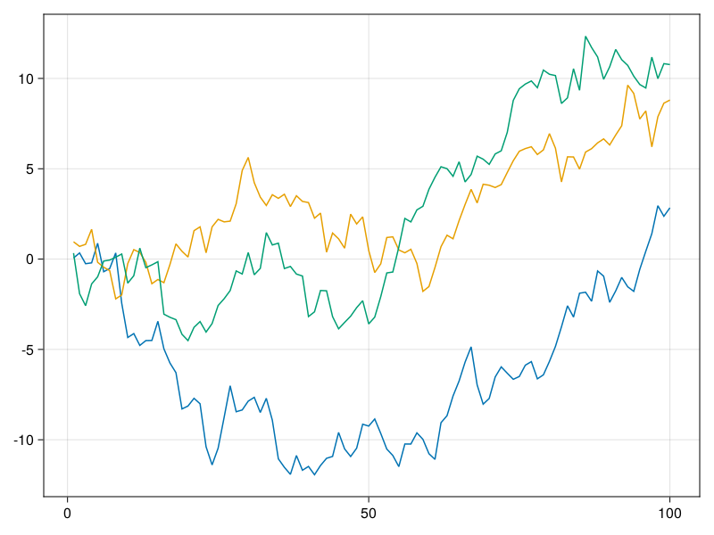

## Explain how the labeling works. 
The ideas here are heavily, heavily inspired by 
[a post on using Voronoi cells to directly label lines by Harry Stevens](https://observablehq.com/@harrystevens/directly-labelling-lines).

## Setup julia


## We start with a plot
```julia
using Random
Random.seed!(1)
f = lines(cumsum(randn(100)), label="Are Great",
  color=Cycled(1), marker=:rect)
lines!(f.axis, cumsum(randn(100)), label="Direct",
  color=Cycled(2))
lines!(f.axis, cumsum(randn(100)), label="Labels",
  color=Cycled(3))
f
```




## We first a Voronoi tesselation of the space
Here, each cell corresponds to a point in the original plot. 
Each cell color shows the line associated with that color. 

```julia
plots, labels = Makie.get_labeled_plots(f.axis; merge=false, unique=false)
points, groups = _get_point_groups(plots)
rect = _get_points_rect(points)
edges = Vector{Tuple{Int,Int}}()
tess = voronoicells(points, rect; edges)

for grpid in eachindex(groups)
  for cell in tess.Cells[groups[grpid]]
    poly!(f.axis, cell, color=Cycled(grpid))
  end 
end 
f
```


## We want to label a plot in a large region associated with a single line.
To find this, we use the set of adjacency information from the Delaunay graph,
and remove any edge that crosses between regions. We also want to remove
the smallest group of edges. We take a quantilelevel to determine
a threshold for "small" area. This is set to 50% or the median
by default. 
```julia
edges = _filter_edges!(edges, groups, tess; quantilelevel=0.6) # forward quantilelevel

# now show the edges 
for edge in edges
  src,dst = edge[1],edge[2]
  lines!(f.axis, [points[src], points[dst]], color=:black, linewidth=1.5)
end
f # show the figure again
```


## To find big regions associated with each plot line, we use connected components analysis.
This method walks the graph of adjacencies to find connected components. 
For each connected component, we find the center of its region of Voronoi cells, 
along with the total area of the region. In addition, we also find a reference
point as an average of the points closest to the center. Nearby this reference,
we then also find the largest cells. We then update the direction to 
point to the center of these large cells nearby the reference. 
```julia
regioninfo = _find_regions(edges, points, tess, groups; nearbypoints=5)

for info in regioninfo
  scatter!(f.axis, [info.ref], markersize=20, color=:darkred)
  arrows!(f.axis, [info.ref], [info.dir])
end 
f # show the figure again
```


## Then we simple label points at some offset of that direction. Typically, 0.5 to 1 works well.
```julia
using Random
Random.seed!(1)

f = lines(cumsum(randn(100)), label="Are Great",
  color=Cycled(1), marker=:rect)
lines!(f.axis, cumsum(randn(100)), label="Direct",
  color=Cycled(2))
lines!(f.axis, cumsum(randn(100)), label="Labels",
  color=Cycled(3))

# make it look nicer
f.axis.topspinevisible = false
f.axis.leftspinevisible = false
f.axis.rightspinevisible = false
f.axis.xgridvisible = false

labels = voronoi_labels!(f; offset=1.0)
labels[1].offset[] = 1.5 # manual tweak of one label 

f
```


## 
```julia
weave("label-explainer.jmd", doctype = "github", fig_path = "doc")
```
