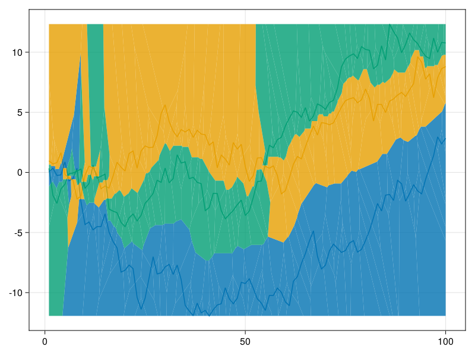
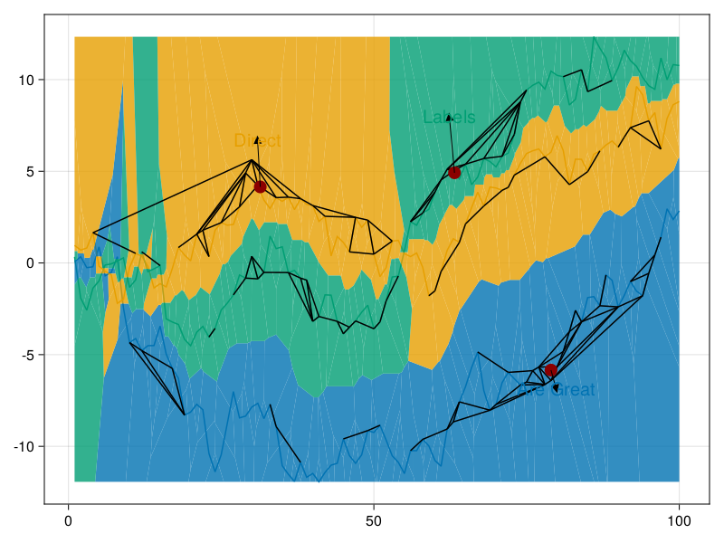

## Explain how the labeling works. 
The ideas here are heavily, heavily inspired by 
[a post on using Voronoi cells to directly label lines by Harry Stevens](https://observablehq.com/@harrystevens/directly-labelling-lines).
[Voronoi cells](https://en.wikipedia.org/wiki/Voronoi_diagram) 
tesselate space into regions that are _closest_ to a given set of points.
These are used here to find places where there is space in the plot to put a label. 

## Setup julia


## Simple example, of how this makes it easy to get directly labeled plots. 
This is how it would with all user-facing code. 
```julia
using Random
Random.seed!(1)

f = lines(cumsum(randn(100)), label="Are Great",
  color=Cycled(1), marker=:rect)
lines!(f.axis, cumsum(randn(100)), label="Direct",
  color=Cycled(2))
lines!(f.axis, cumsum(randn(100)), label="Labels",
  color=Cycled(3))

# make it look nicer
f.axis.topspinevisible = false
f.axis.leftspinevisible = false
f.axis.rightspinevisible = false
f.axis.xgridvisible = false

labels = voronoi_labels!(f; offset=1.0)
labels[1].offset[] = 1.5 # manual tweak of one label 

f
```


## See how it works. 

The setup code will load `voronoi-labels.jl`, which has a set of development codes that 
I will use in this explainer to draw the pictures. These will all be 
commented with an `internal:` tag. Eventually, this will be a package, if there
is interest. 

## We start with a plot
```julia
using Random
Random.seed!(1)
f = lines(cumsum(randn(100)), label="Are Great",
  color=Cycled(1), marker=:rect)
lines!(f.axis, cumsum(randn(100)), label="Direct",
  color=Cycled(2))
lines!(f.axis, cumsum(randn(100)), label="Labels",
  color=Cycled(3))
f
```


## We first a Voronoi tesselation of the space
Here, each cell corresponds to a point in the original plot. 
Each cell color shows the line associated with that color. 

```julia
plots, labels = Makie.get_labeled_plots(f.axis; merge=false, unique=false)
points, groups = _get_point_groups(plots) # internal: make a unified point list 
rect = _get_points_rect(points) # internal: get the bounding box 
edges = Vector{Tuple{Int,Int}}()
tess = voronoicells(points, rect; edges) # internal: get the voronoi cells and delaunay edges

for grpid in eachindex(groups)
  for cell in tess.Cells[groups[grpid]]
    poly!(f.axis, cell, color=Cycled(grpid))
  end 
end 
f
```




## We want to label a plot in a large region associated with a single line.
To find this, we use the set of adjacency information from the Delaunay graph,
and remove any edge that crosses between regions. We also want to remove
the smallest group of edges. We take a quantilelevel to determine
a threshold for "small" area. This is set to 60% or just a bit 
larger than the median. 
```julia
# internal: remove Delaunay edges between points from different plotlines, and
#           also between areas that are too small. 
edges = _filter_edges!(edges, groups, tess; quantilelevel=0.6) 

# now show the edges 
for edge in edges
  src,dst = edge[1],edge[2]
  lines!(f.axis, [points[src], points[dst]], color=:black, linewidth=1.5)
end
f # show the figure again
```


## To find big regions associated with each plot line, we use connected components analysis.
This method walks the graph of adjacencies to find connected components. 
For each connected component, we find the center of its region of Voronoi cells, 
along with the total area of the region. In addition, we also find a reference
point as an average of the points closest to the center. Nearby this reference,
we then also find the largest cells. We then update the direction to 
point to the center of these large cells nearby the reference. 

The arrow in this plot shows the direction from a point on the line into the
region where there is free space for a label. 
```julia
# internal: find the region where we should put a plot, along with a point
#           on the line and a direction towards the center of the space
regioninfo = _find_regions(edges, points, tess, groups; nearbypoints=5)

for info in regioninfo
  scatter!(f.axis, [info.ref], markersize=20, color=:darkred)
  arrows!(f.axis, [info.ref], [info.dir])
end 
f # show the figure again
```


## The idea is that we can scale where the label goes along that direction
This uses a uniform offset of 1.0 for each plot. 
```julia
for (info, label, plot) in zip(regioninfo, labels, plots)
  lbl = _draw_label(f.axis, info.ref, info.ref+info.dir, 
      label, plot; offset=1.0)
end 
f # show the figure again
```




It's a little hard to see where the actual labels go in this plot due to the color.
But they are right at the ends of the arrow. 

Now, let's show this all without the extra guidance. 

## Then we simple label points at some offset of that direction. Typically, 0.5 to 1 works well.
This is how it would with all user-facing code 
```julia
using Random
Random.seed!(1)

f = lines(cumsum(randn(100)), label="Are Great",
  color=Cycled(1), marker=:rect)
lines!(f.axis, cumsum(randn(100)), label="Direct",
  color=Cycled(2))
lines!(f.axis, cumsum(randn(100)), label="Labels",
  color=Cycled(3))

# make it look nicer
f.axis.topspinevisible = false
f.axis.leftspinevisible = false
f.axis.rightspinevisible = false
f.axis.xgridvisible = false

labels = voronoi_labels!(f; offset=1.0)
labels[1].offset[] = 1.5 # manual tweak of one label 

f
```


## 
```julia
weave("label-explainer.jmd", doctype = "github", fig_path = "doc")
```
